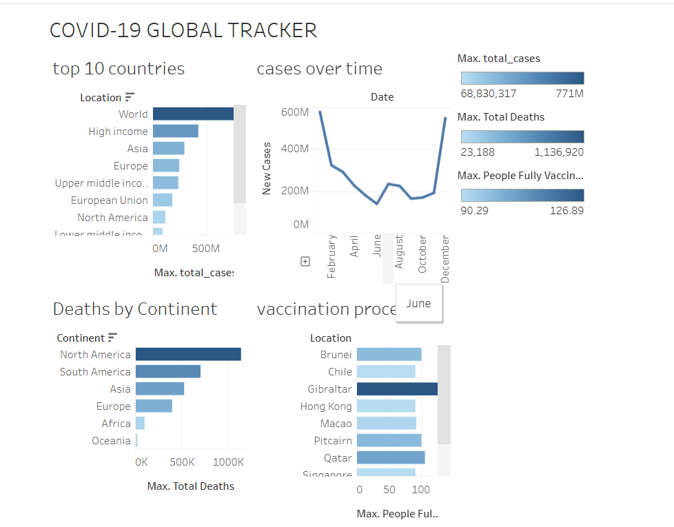

# 🦠 COVID-19 Global Tracker Dashboard

## 📌 Project Overview
An interactive dashboard analyzing global COVID-19 data 
across 200+ countries covering total cases, deaths and 
vaccination progress built using Tableau Public.

## 🛠️ Tools Used
- Tableau Public
- Our World in Data COVID-19 Dataset (Kaggle)

## 📊 Charts Built
- 🏆 Top 10 Most Affected Countries (Bar Chart)
- 📈 Global New Cases Over Time (Line Chart)
- ☠️ Total Deaths by Continent (Bar Chart)
- 💉 Vaccination Progress by Country (Bar Chart)

## 🔍 Key Insights
1. USA, India and Brazil recorded the highest total 
   COVID cases globally
2. Omicron wave in January 2022 caused the highest 
   single-day case surge globally
3. Europe recorded the highest total deaths by continent
4. Vaccination rollout accelerated significantly in 2021
5. Asia had the highest number of total vaccinations 
   administered globally

## 🔗 Live Dashboard
[▶ Click here to view on Tableau Public](https://public.tableau.com/app/profile/bavyasri.samineni/viz/covid-19GlobalTracker/Dashboard1?publish=yes)

## 📸 Dashboard Preview

## 📁 Dataset
- Source: Our World in Data / Kaggle
- Size: 200,000+ daily records across 200+ countries
- Columns used: location, date, total_cases, new_cases, 
  total_deaths, people_fully_vaccinated_per_hundred

## 🎯 Skills Demonstrated
- Data Visualization
- Tableau Dashboard Design
- Time Series Analysis
- Geographic Data Analysis
- Public Health Data Analysis
